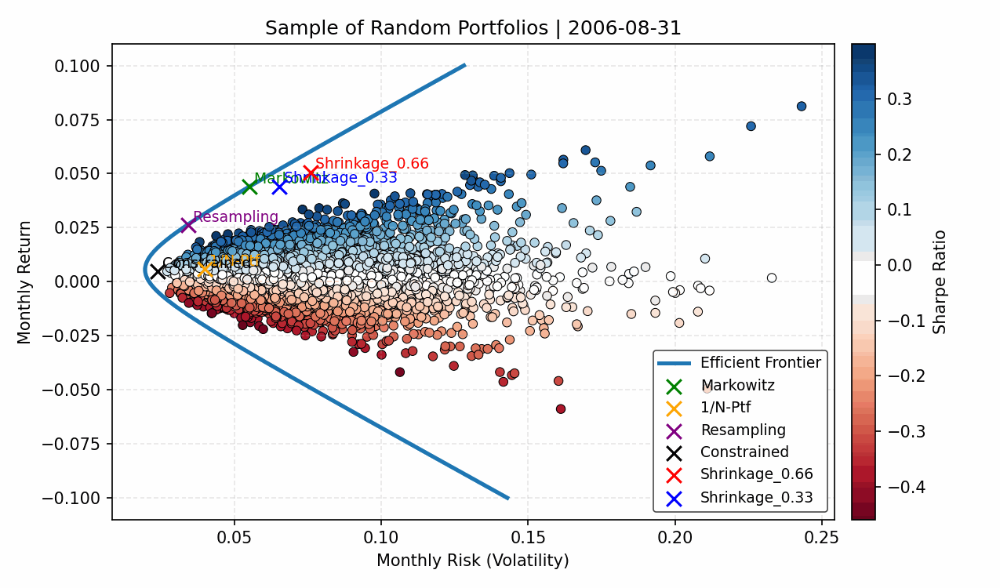

# asset_pricing_project_group_2

### Introduction

This is the repository containing the PDF report and the source codes for Group's 2 Asset Pricing & Risk module Final Project on Markowitz' portfolio optimization problem and related techniques. This project spex cifically explores optimal portfolio construction using Dow Jones 300 stocks time series data and how the estimation error of the mean-variance optimizer leads to substantial losses in performance for optimal portfolios. We try different alternative portfolio optimisation techniques that would lead to different optimal portfolios, and we analise both behaviour and performance.



### Instructions for Usage

In order to use the source code, please follow the steps below.

1) Install a Python version greater than 3.11 and use VSCode or any IDE that allows to run Python projects like this one. For cloning the repository, use the terminal of your computer and run the following command:

```bash
git clone https://github.com/ikercb2000/asset_pricing_project_group_2.git
cd asset_pricing_project_group_2
```

Once cloned, please open the directory where the project is store in your preferred IDE for usage.

2) Create a virtual environment (.venv) in the repository for usage. This will contain all the packages needed without creating path conflicts and other problems that do not allow to execute the code. If running it in Windows, please execute the following command on the terminal:

```bash
python -m venv .venv
.venv\Scripts\activate
```

If running it in MacBook, please execute the following command on the terminal:

```bash
python3 -m venv .venv
source .venv/bin/activate
```

*IMPORTANT: When reopening the repository of the project, make sure you execute the second line of the previous snippets (depending on your OS) again, so that it is executed using the packages.*

3) Install the packages needed to run the code. These are stored in the ".lock" file because Poetry was used for development, but the user only needs to execute the following command on the terminal to install the packages in a virtual environment:

```bash
pip install -r requirements.txt
```

4) Open the main notebook "main.ipynb" and select the kernel of the Python environment we have just created. Explore the options for "Python Environments" until you find the ".venv" Python environment. Once the kernel is selected, execute each cell in order to see the outputs and estimate the different quantities and results. An explanation of the outputs and others is given for mostly each cell.

We have included extra results which are not needed for the project but that give an overview of the analysis we have done in order to present the results in the report. This are part of the appendix.